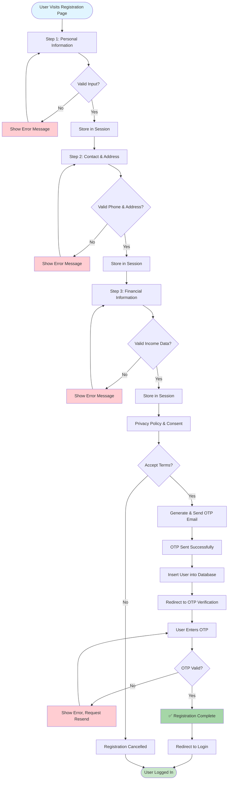
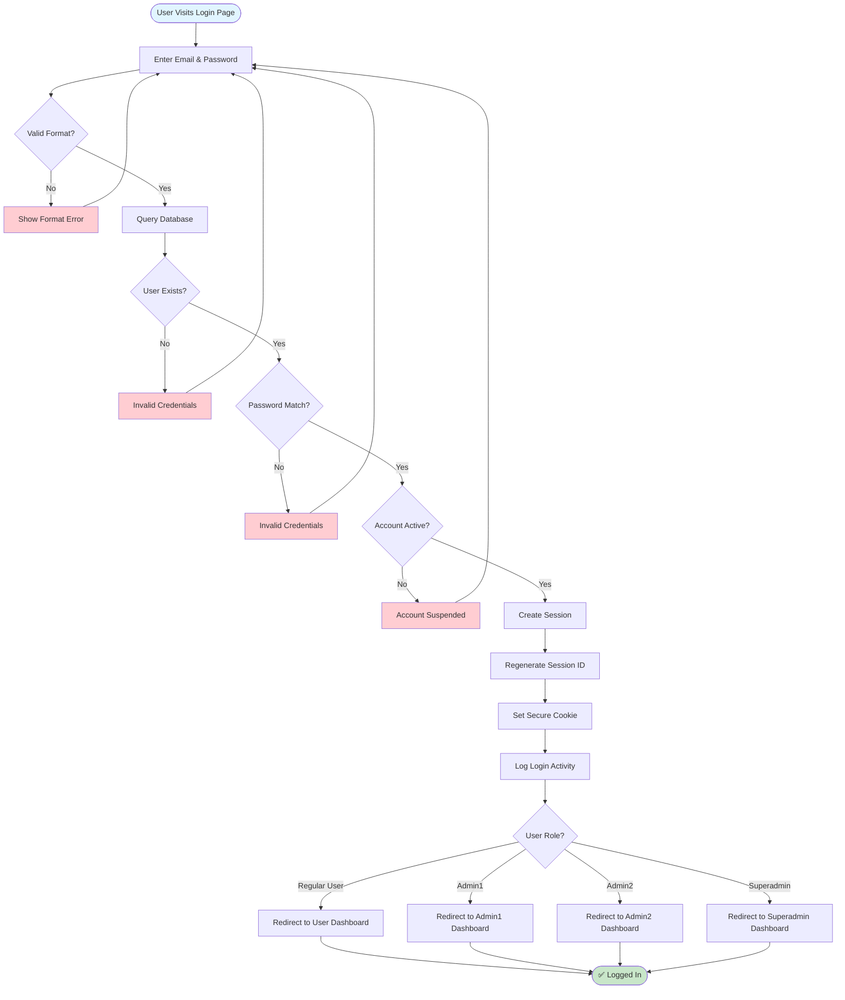
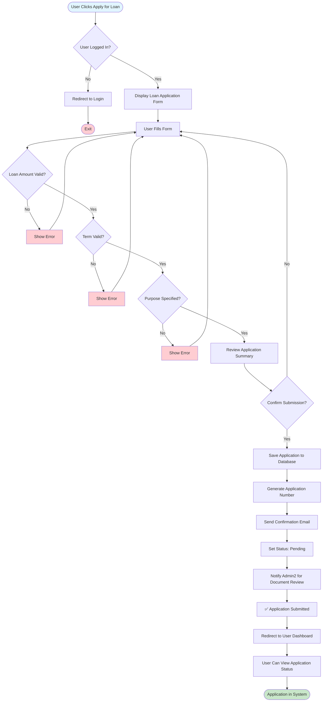
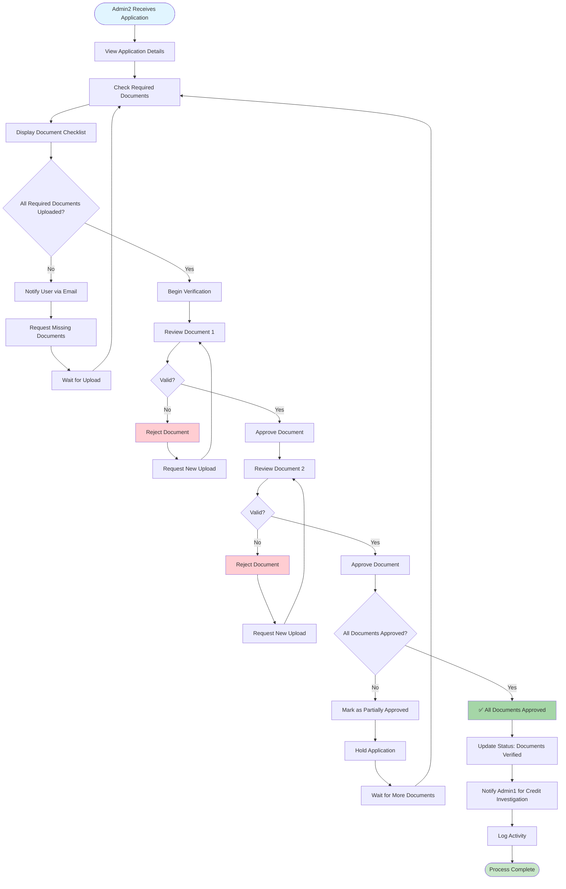
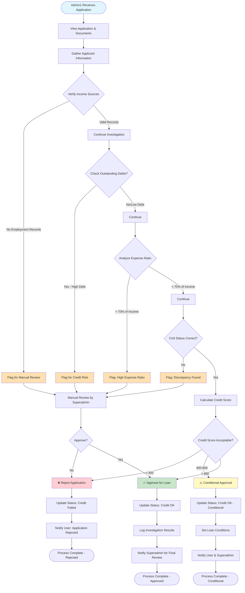
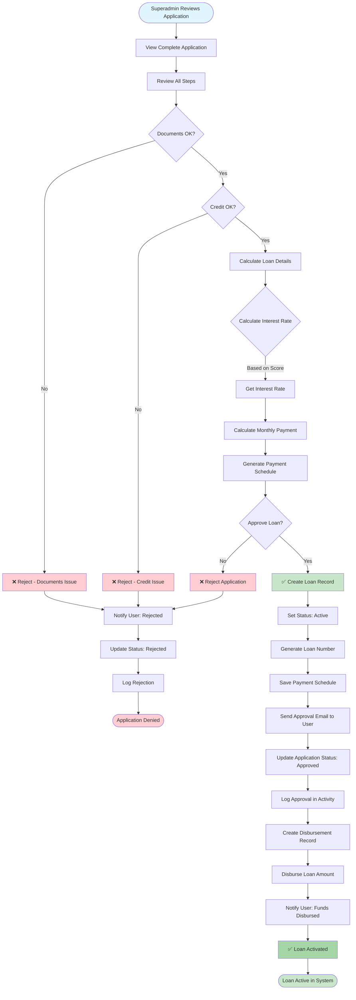
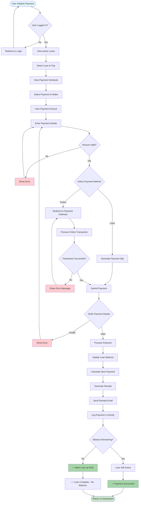
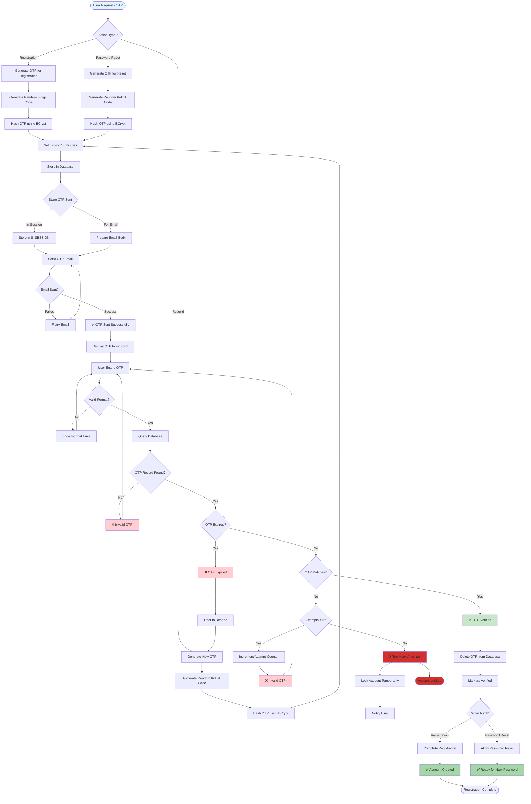

# 🔄 CYCLOAN System Flowcharts

**Created:** November 5, 2025  
**Purpose:** Complete system workflows and decision trees  
**Format:** Mermaid Flowchart diagrams ready for mermaid.js.org

---

## 📋 Table of Contents

1. [User Registration Flow](#1-user-registration-flow)
2. [User Login Flow](#2-user-login-flow)
3. [Loan Application Process](#3-loan-application-process)
4. [Document Verification Flow](#4-document-verification-flow)
5. [Credit Investigation Flow](#5-credit-investigation-flow)
6. [Loan Approval Flow](#6-loan-approval-flow)
7. [Payment Processing Flow](#7-payment-processing-flow)
8. [Admin Dashboard Navigation](#8-admin-dashboard-navigation)
9. [System Admin Controls](#9-system-admin-controls)
10. [OTP Generation & Verification](#10-otp-generation--verification)

---

## 1. User Registration Flow



---

## 2. User Login Flow



---

## 3. Loan Application Process



---

## 4. Document Verification Flow



---

## 5. Credit Investigation Flow



---

## 6. Loan Approval Flow



---

## 7. Payment Processing Flow



---

## 8. Admin Dashboard Navigation

```mermaid
flowchart TD
    Start([Admin Logs In]) --> CheckRole{User Role?}

    CheckRole -->|Admin1| Admin1Main[Admin1 Dashboard]
    CheckRole -->|Admin2| Admin2Main[Admin2 Dashboard]
    CheckRole -->|Superadmin| SuperMain[Superadmin Dashboard]

    Admin1Main --> Admin1Menu["📋 Admin1 Functions"]
    Admin1Menu --> A1Opt1[1. View Applications]
    Admin1Menu --> A1Opt2[2. Credit Investigation]
    Admin1Menu --> A1Opt3[3. View Payments]
    Admin1Menu --> A1Opt4[4. Activity Logs]
    Admin1Menu --> A1Opt5[5. Reports]

    A1Opt1 --> A1Dashboard[Dashboard: Pending Investigations]
    A1Opt2 --> A1Credit[Investigation Details & Decision]
    A1Opt3 --> A1Payments[Payment Records & History]
    A1Opt4 --> A1Logs[System Activity Log]
    A1Opt5 --> A1Reports[Generate Reports]

    Admin2Main --> Admin2Menu["📋 Admin2 Functions"]
    Admin2Menu --> A2Opt1[1. View Applications]
    Admin2Menu --> A2Opt2[2. Document Verification]
    Admin2Menu --> A2Opt3[3. Remarks & Notes]
    Admin2Menu --> A2Opt4[4. Activity Logs]
    Admin2Menu --> A2Opt5[5. Reports]

    A2Opt1 --> A2Dashboard[Dashboard: Pending Documents]
    A2Opt2 --> A2Documents[Verify & Approve Documents]
    A2Opt3 --> A2Remarks[Add Remarks to Applications]
    A2Opt4 --> A2Logs[System Activity Log]
    A2Opt5 --> A2Reports[Generate Reports]

    SuperMain --> SuperMenu["📋 Superadmin Functions"]
    SuperMenu --> SOpt1[1. Final Approval]
    SuperMenu --> SOpt2[2. User Management]
    SuperMenu --> SOpt3[3. Admin Management]
    SuperMenu --> SOpt4[4. System Reports]
    SuperMenu --> SOpt5[5. Settings]
    SuperMenu --> SOpt6[6. Activity Logs]

    SOpt1 --> SApproval[Review & Approve Loans]
    SOpt2 --> SUserMgmt[Manage User Accounts]
    SOpt3 --> SAdminMgmt[Manage Admin Accounts]
    SOpt4 --> SReports[Generate System Reports]
    SOpt5 --> SSettings[Configure System Settings]
    SOpt6 --> SLogs[View All Activities]

    A1Dashboard --> Action1{Select Action}
    A1Credit --> Action1
    A1Payments --> Action1
    A1Logs --> Action1
    A1Reports --> Action1

    A2Dashboard --> Action2{Select Action}
    A2Documents --> Action2
    A2Remarks --> Action2
    A2Logs --> Action2
    A2Reports --> Action2

    SApproval --> ActionS{Select Action}
    SUserMgmt --> ActionS
    SAdminMgmt --> ActionS
    SReports --> ActionS
    SSettings --> ActionS
    SLogs --> ActionS

    Action1 --> Process1[Execute Function]
    Action2 --> Process2[Execute Function]
    ActionS --> ProcessS[Execute Function]

    Process1 --> End([Return to Dashboard])
    Process2 --> End
    ProcessS --> End

    style Start fill:#e1f5ff
    style Admin1Main fill:#bbdefb
    style Admin2Main fill:#c8e6c9
    style SuperMain fill:#fff9c4
    style End fill:#ffccbc
```



---

## 9. System Admin Controls

```mermaid
flowchart TD
    Start([Superadmin Accesses Admin Panel]) --> MainMenu["🔧 System Administration"]

    MainMenu --> UserMgmt["👥 User Management"]
    MainMenu --> AdminMgmt["👨‍💼 Admin Management"]
    MainMenu --> LoanMgmt["💰 Loan Management"]
    MainMenu --> SystemConfig["⚙️ System Configuration"]
    MainMenu --> Reports["📊 Reports & Analytics"]

    UserMgmt --> ViewUsers[View All Users]
    ViewUsers --> UserAction{Action?}
    UserAction -->|Suspend| SuspendUser[Suspend User Account]
    UserAction -->|Activate| ActivateUser[Activate User Account]
    UserAction -->|Delete| DeleteUser[Delete User Account]
    UserAction -->|View Details| UserDetails[View User Details]

    AdminMgmt --> ViewAdmins[View All Admins]
    ViewAdmins --> AdminAction{Action?}
    AdminAction -->|Add| AddAdmin[Add New Admin]
    AdminAction -->|Edit| EditAdmin[Edit Admin Details]
    AdminAction -->|Remove| RemoveAdmin[Remove Admin]
    AdminAction -->|Reset Password| ResetAdmin[Reset Admin Password]

    AddAdmin --> SelectRole{Select Role}
    SelectRole -->|Admin1| CreateA1[Create Admin1 Account]
    SelectRole -->|Admin2| CreateA2[Create Admin2 Account]
    CreateA1 --> SendCredentials[Send Login Credentials]
    CreateA2 --> SendCredentials
    SendCredentials --> LogCreation[Log Admin Creation]

    LoanMgmt --> ViewLoans[View All Loans]
    ViewLoans --> LoanAction{Action?}
    LoanAction -->|Approve| ApproveLoan[Approve Loan]
    LoanAction -->|Reject| RejectLoan[Reject Loan]
    LoanAction -->|Modify| ModifyLoan[Modify Loan Terms]
    LoanAction -->|Close| CloseLoan[Close/Complete Loan]

    SystemConfig --> DbConfig[Database Configuration]
    SystemConfig --> EmailConfig[Email Settings]
    SystemConfig --> SecurityConfig[Security Settings]
    SystemConfig --> TimeZoneConfig[Timezone Configuration]

    DbConfig --> BackupDB[Backup Database]
    BackupDB --> ScheduleBackup[Schedule Regular Backups]

    EmailConfig --> SMTPSettings[SMTP Settings]
    SMTPSettings --> TestEmail[Test Email Connection]

    SecurityConfig --> ChangeCSRF[Update CSRF Tokens]
    SecurityConfig --> SessionConfig[Session Configuration]

    TimeZoneConfig --> SetTZ[Set System Timezone: Asia/Manila]
    SetTZ --> VerifyTZ[Verify All Timestamps]

    Reports --> LoanReports[Loan Reports]
    Reports --> PaymentReports[Payment Reports]
    Reports --> UserReports[User Statistics]
    Reports --> ActivityReports[Activity Logs Report]

    LoanReports --> ExportLoan[Export as PDF/CSV]
    PaymentReports --> ExportPayment[Export as PDF/CSV]
    UserReports --> ExportUser[Export as PDF/CSV]
    ActivityReports --> ExportActivity[Export as PDF/CSV]

    SuspendUser --> LogAction1[Log Action]
    ActivateUser --> LogAction1
    DeleteUser --> LogAction1
    RemoveAdmin --> LogAction1
    CloseLoan --> LogAction1

    LogAction1 --> End([Return to Admin Panel])

    style Start fill:#e1f5ff
    style MainMenu fill:#fff9c4
    style UserMgmt fill:#f8bbd0
    style AdminMgmt fill:#e1bee7
    style LoanMgmt fill:#c8e6c9
    style SystemConfig fill:#b2dfdb
    style Reports fill:#ffccbc
    style End fill:#a5d6a7
```



---

## 10. OTP Generation & Verification



---

## 🎯 Quick Navigation Guide

| Flowchart                | Process                         | Users         |
| ------------------------ | ------------------------------- | ------------- |
| 1️⃣ Registration          | New user account creation       | Regular Users |
| 2️⃣ Login                 | User authentication             | All Users     |
| 3️⃣ Loan Application      | Loan request submission         | Regular Users |
| 4️⃣ Document Verification | Document approval               | Admin2        |
| 5️⃣ Credit Investigation  | Credit check process            | Admin1        |
| 6️⃣ Loan Approval         | Final approval decision         | Superadmin    |
| 7️⃣ Payment Processing    | Payment submission & processing | Regular Users |
| 8️⃣ Admin Navigation      | Dashboard menu system           | All Admins    |
| 9️⃣ System Admin          | System management controls      | Superadmin    |
| 🔟 OTP Management        | OTP generation & verification   | All Users     |

---

## 💡 How to Use These Flowcharts

### **View Online (Recommended)**

1. Go to **[mermaid.js.org](https://mermaid.js.org)**
2. Click "**Start Editing**"
3. Copy a flowchart code from this file
4. Paste into the editor
5. See visualization instantly ✅

### **In Markdown Files**

````markdown
```mermaid
[copy flowchart code here]
```
````

```

### **Export & Share**
- Screenshot the flowchart
- Export as SVG/PNG
- Add to presentations/documentation
- Share with team members

---

## 🔗 Related Documentation

- 📊 **CYCLOAN_DATABASE_MERMAID_DIAGRAM.md** - Database schema & ER diagrams
- 📖 **PHILIPPINES_IMPLEMENTATION_GUIDE.md** - Implementation steps
- 🔐 **PHILIPPINES_COMPLETE_PACKAGE_SUMMARY.md** - System overview

---

## 📊 Process Statistics

| Process | Steps | Decision Points | Notifications | Time Estimate |
|---------|-------|-----------------|---------------|---------------|
| Registration | 5 steps | 5 | 2 (OTP + Confirmation) | 5-10 min |
| Login | 3 steps | 4 | 0 | 1-2 min |
| Loan Application | 3 steps | 3 | 2 (Submit + Admin) | 10-15 min |
| Document Verification | Multiple | 4+ | 2 (Approve + Reject) | Variable |
| Credit Investigation | 6 steps | 6 | 1 (Notification) | 2-5 business days |
| Loan Approval | 4 steps | 3 | 3 (Decision emails) | 1-2 hours |
| Payment Processing | 5 steps | 4 | 2 (Confirmation + Email) | 2-5 min |
| OTP Verification | 4 steps | 5 | 1 (OTP Email) | 1-2 min |

---

## ✅ Quality Checklist

- ✅ All user workflows documented
- ✅ All decision points included
- ✅ Error handling paths shown
- ✅ Notifications marked
- ✅ Admin functions detailed
- ✅ Security steps highlighted
- ✅ Database interactions shown
- ✅ Email/notification flows included
- ✅ Color-coded for clarity
- ✅ Ready for mermaid.js.org

---

**Created:** November 5, 2025
**Status:** ✅ Complete & Production-Ready
**Format:** Mermaid Flowchart Syntax
**For:** CYCLOAN Loan Management System

---

### 🚀 Next Steps

1. **View Diagrams:** Copy code to [mermaid.js.org](https://mermaid.js.org)
2. **Share with Team:** Export flowcharts as images
3. **Document Process:** Add to project documentation
4. **Train Staff:** Use flowcharts for staff training
5. **Reference:** Keep as standard process documentation

```
